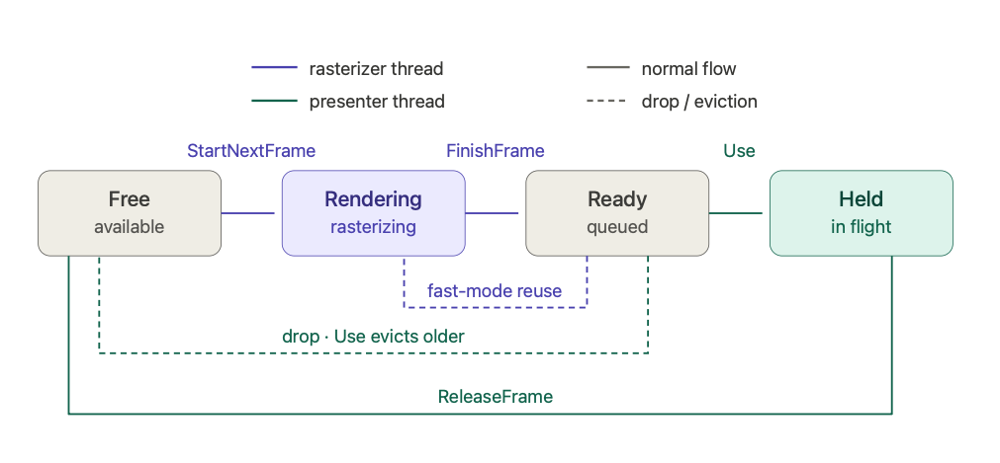

# mode-13hx

- [Old-School Graphics in C# / .Net 8, Part 1: Teaching an Old Dog New Tricks (Introducing Mode 13hx)](https://dev.to/peter_truchly_4fce0874fd5/old-school-graphics-in-c-net-8-part-1-teaching-an-old-dog-new-tricks-introducing-mode-13hx-mpk)

## Quick start

~~~sh
// run test (bouncing box) with 8 frame slots (-l 8), fullscreen (-f), framechart (-d) in 4k
// it will downscale (or upscale) to any display resolution
dotnet mode13hx.dll test -f -d -l 8 -w 3840 -h 2160

// run blank rasterizer fullscreen (-f), V-Sync (-v) in default (1920x1080) resolution
dotnet mode13hx.dll blank -f -v

// enable GPU-decompressed RLE frames (PCIe-bound systems benefit; Apple Silicon does not)
dotnet mode13hx.dll test --frame-compression -c rle

// "fast" mode: rasterizer drops its own old frames instead of blocking, CPU stays hot
// most useful with vsync — get stable framepacing without idle/wakeup hiccups
dotnet mode13hx.dll test -d --fast -v
~~~

Feeling nostalgic for Mode 13h? Try out Mode 13HX - a modern alternative inspired by the classic graphics mode, built on [Silk.NET](https://dotnet.github.io/Silk.NET/) (Vulkan + windowing + input) and targeting **.NET 10**. Earlier versions used OpenTK / OpenGL; the project moved to Vulkan to enable cross-platform compute (frame decompression).

## Development setup

The renderer talks Vulkan everywhere. macOS uses [MoltenVK](https://github.com/KhronosGroup/MoltenVK) (Vulkan-on-Metal) under the hood.

### macOS

Install the [LunarG Vulkan SDK](https://vulkan.lunarg.com/sdk/home#mac) (1.4.x or newer), then **source `setup-env.sh` in every shell you build or run from**:

```bash
source ~/VulkanSDK/1.4.341.1/setup-env.sh
```

This sets `VULKAN_SDK`, `VK_DRIVER_FILES` (MoltenVK ICD), `VK_ADD_LAYER_PATH`, and `DYLD_LIBRARY_PATH`. **All four are needed** — without them the loader either won't find a driver or aborts during MoltenVK transitive loading. Adding the source line to your shell rc isn't recommended (it slows down every shell startup); a project-local script you `source` when working on this repo is cleaner.

The build also reads `$VULKAN_SDK` and copies `libvulkan.1.dylib` into the output directory next to the GLFW native lib. Resolution order:

1. `$VULKAN_SDK/lib/libvulkan.1.dylib` (LunarG SDK, sourced via `setup-env.sh`)
2. `/usr/local/lib/libvulkan.1.dylib` (Homebrew on Intel Macs / older installs)
3. `/opt/homebrew/lib/libvulkan.1.dylib` (Homebrew on Apple Silicon)

If none exist, the build prints a warning and skips the copy. You can also `brew install vulkan-loader` as an alternative to the LunarG SDK, but you still need the SDK for `glslc` and the validation layers.

### Linux (Ubuntu/Debian)

```bash
sudo apt install libvulkan1 vulkan-tools libvulkan-dev
```

The system loader (`libvulkan.so.1`) is enough — no per-project setup, no env vars to source. GPU vendors (NVIDIA proprietary, Mesa for AMD/Intel) install their ICDs into `/usr/share/vulkan/icd.d/` automatically.

### Windows

Install the [LunarG Vulkan SDK](https://vulkan.lunarg.com/sdk/home#windows) (for `glslc` and validation layers) or rely on the loader shipped by your GPU driver. No project-side setup needed; `vulkan-1.dll` lives in `System32`.

## CLI flags

| Flag | Description |
|---|---|
| `-w`, `-h` | Frame width / height (default 1920×1080). The window scales to display resolution. |
| `-f` | Fullscreen. |
| `-v` | V-Sync. |
| `-l` | Frame prerender limit. Total slots = `-l + 1`; default `-l 1` (two slots). Higher values reduce frame drops when the rasterizer is faster than the presenter, at the cost of more memory and a touch more input lag. |
| `-d` | Show frametime chart (test mode). |
| `--frame-compression` | Enable CPU-side frame compression with GPU decompression. Useful for PCIe-bound GPUs and lower-end discrete graphics; minimal benefit on unified-memory architectures (Apple Silicon). |
| `-c` | Compressor: `rle`, `rle2`, `bl16`, `l26`, `s64`, `sl64`. Effective only with `--frame-compression`. |
| `--compression-threads` | CPU thread count for parallel compressors (`l26`, `s64`, `sl64`). Default 16. |
| `--fast` | Rasterizer never blocks; if the buffer is full it drops its own oldest unread frame. Keeps the CPU continuously busy so VSync / buffer-full pacing doesn't park it in a deep idle state with a wakeup-ramp hiccup on the next frame. Pair with `-v` for stable framepacing without idle hiccups. |

## Frame pacing model

The rasterizer (CPU thread that fills pixels into a framebuffer slot) and the presenter (window event loop that uploads slots to the GPU and triggers display) run independently. `FrameBuffer` owns a small pool of pixel slots and orchestrates handoff between them through a four-state lifecycle:


Total slot count = `-l value + 1`. The `+1` is always reserved by the held-state lifecycle — the slot the presenter just took is *never* the slot the rasterizer claims next. Fast mode makes most sense with a buffer large enought to hold at least 2 ready frames, then the presentation layer could pick latest prepared frame at any time while CPU could work on latest inputs uninterrupted as well.

Internally `FrameBuffer` is a flat array of small structs (`SlotState` byte + `uint Sequence`), scanned linearly. At realistic slot counts (2–16) sequential scans of contiguous struct memory beat any pointer-walking structure and produce zero per-frame allocations. There was a benchmark done showing the comparison vs. an equivalent linked-list design (~0.4–0.6× time, 0 vs. 5–50 MB/run allocations).

### Two rasterizer modes

| Mode | Behavior when buffer is full | Use when |
|---|---|---|
| **Legacy** (default) | Rasterizer **blocks** on a free-slot semaphore until the presenter takes a frame | You want the rasterizer paced with the presenter (lower CPU usage, lower power). Default. |
| **`--fast`** | Rasterizer **drops** its own oldest unread frame and reuses that slot — never blocks | You want stable framepacing under VSync or input-bound rendering. The CPU stays in a high P-state because the rasterizer thread is always working, avoiding the deep-idle / wakeup-ramp hiccup that otherwise shows up on the frame chart. |

`--fast` prefers to drop slots whose CPU-side compression task has already finished (when `--frame-compression` is set), so the drop is allocation-free and lock-free. Only if every Ready slot is still mid-compression does it fall back to "drop oldest, wait briefly on its task."

### Two presenter behaviors

`Use()` (called once per display frame) decides which Ready slot to display:

| Setting | Behavior |
|---|---|
| `--drop-frames` (default **true**) or `--fast` | Take the **newest** Ready slot. Drop all older Ready slots back to Free. Lowest input-to-display latency. |
| Otherwise | Take the **oldest** Ready slot (FIFO). Every rasterized frame eventually displays. (Frames form a queue, larger -l value will noticeably increase input lag.) |

**Note:** in CommandLineParser 2.x, **you can't set a default-true bool to false from the CLI**; FIFO mode requires editing `CommonOptions.DropFrames` default.

### Practical recipes

| Goal | Flags | Why |
|---|---|---|
| Default development | (no extras) | Legacy + drop-frames = balanced, low power |
| Stable framepacing on macOS | `--fast -v` | VSync + hot CPU. The killer combo on Apple Silicon. |
| Maximum throughput test | `--fast` | Rasterizer flat-out, presenter as maximum speed |
| PCIe-bound desktop GPU | `--frame-compression -c rle` | Compression cuts upload bandwidth ~50× |
| Lowest possible latency | `--fast -v -l 2` | Multiple prerender slots + drop intermediate frames. |

### How `-l` interacts with the modes

- **In legacy mode**, `-l` controls how many frames the rasterizer can stay ahead of the presenter. Larger `-l` lets the rasterizer fill more buffer before having to wait — useful at high resolutions where rasterization is slow.
- **In `--fast` mode**, `-l` is essentially decorative — the rasterizer never blocks regardless of buffer size. Throughput plateaus at the rasterizer's CPU-bound rate at any `-l ≥ 1`. Smaller `-l` means lower memory use.

So if you find yourself reaching for `-l 100` to keep the CPU hot, you probably want `--fast -l 1` instead.

### Note vs. the OpenGL version

The OpenGL build uploaded each frame via `glTexImage2D`, which the driver deep-copied into its own memory — so the rasterizer could safely cycle through any backbuffer in RAM, including the one just sent to the GPU. `-l 1` (two slots: one ready, one being rendered) was enough.

The Vulkan build does the equivalent with `vkCmdCopyBufferToImage` inside `UploadFrame`: the source slot is `memcpy`'d into a Vulkan staging buffer synchronously, then the upload command is recorded. By the time `UploadFrame` returns, the source pixels have been consumed and the slot is free for the rasterizer to overwrite. Same `-l 1` minimum as OpenGL.

## Compressors at a glance

| Name  | Approach | Notes |
|---|---|---|
| `rle` | Per-slice run-length encoding | Simple, single-threaded. |
| `rle2` | Run-length encoding, packed variant | Slightly better ratio than `rle`. |
| `bl16` | Block-based 16-pixel encoding | Faster decompression, modest ratio. |
| `l26`  | Hierarchical 26-bit packing | Parallelized. |
| `s64`  | 64-pixel slice compression | Parallelized. |
| `sl64` | Striped 64-pixel slice variant | Parallelized. |

> The compression path exists primarily for systems where the PCIe link is the bottleneck (low-end discrete GPUs, PCIe x8 lanes). On unified-memory architectures (Apple Silicon, AMD APUs) it does not help and can hurt — the uncompressed SSBO path is essentially free.

## Building

```bash
cd src
# macOS only: source the SDK env first (see "Development setup" above)
source ~/VulkanSDK/1.4.341.1/setup-env.sh

dotnet build
dotnet run -- test -f -d
```

On Linux / Windows the `source` line is unnecessary.

## Modifying shaders

`*.spv` files are committed to the repo so a default `dotnet build` does not need `glslc` on `PATH`. To regenerate a shader after editing it:

```bash
glslc src/resources/shader.vert        -o src/resources/shader.vert.spv
glslc src/resources/shader.frag        -o src/resources/shader.frag.spv
glslc src/resources/shader_ssbo.frag   -o src/resources/shader_ssbo.frag.spv
glslc src/resources/decomp_rle.comp    -o src/resources/decomp_rle.comp.spv
# ...etc for the other decomp_*.comp files
```

`glslc` ships with the LunarG Vulkan SDK.

## Shipping to end users

The "source `setup-env.sh`" dance is for **developers**, not end users. End users won't have the Vulkan SDK installed. The shipping story is platform-specific:

### Linux & Windows: zero packaging work

Both platforms expect Vulkan to come from the GPU driver. End users with a recent driver (or who run `apt install libvulkan1`) already have everything they need. Just ship your binaries — they dynamically link `libvulkan.so.1` / `vulkan-1.dll` and the system loader does the rest.

### macOS: bundle MoltenVK inside a `.app`

Apple has no Vulkan driver — MoltenVK is the driver, and you have to ship it with your app. The standard layout is:

```
MyApp.app/
  Contents/
    MacOS/MyApp                                  ← executable, rpath = @executable_path/../Frameworks
    Frameworks/
      libvulkan.1.dylib                          ← Vulkan loader
      libMoltenVK.dylib                          ← Vulkan-on-Metal driver
    Resources/
      vulkan/icd.d/MoltenVK_icd.json             ← library_path = ../../../Frameworks/libMoltenVK.dylib
```

Your code sets `VK_DRIVER_FILES` to `[bundle]/Contents/Resources/vulkan/icd.d/MoltenVK_icd.json` at startup (or relies on the bundle-relative search the loader does on macOS), and the loader picks up MoltenVK from inside the bundle. No env vars, no SDK install on the user's machine. MoltenVK is Apache-2.0 licensed and freely redistributable; this is what shipped Vulkan games on macOS (Dota 2, Baldur's Gate 3, Unity / Unreal Mac builds, vkQuake) all do.

This project doesn't ship a `.app` packager today — it's a developer-oriented base. When/if you build something on top that needs distribution, this is the macOS-specific work to add.

## What this gives you

This lightweight framework provides direct pixel access and simple APIs for 2D/3D graphics, supporting **Windows**, **Linux**, and **macOS**. Whether you're creating retro-style games or experimenting with low-level graphics, Mode 13HX offers the ease of use of the past with the power of today.

- **Resolution**: 4k, 1920x1080 (or 1280x720) vs. 320x200.
- **Color Depth**: 24-bit RGB (True Color) vs. 8-bit (256-color palette).
- **Hardware Access**: Direct pixel manipulation with optional hardware acceleration, no reliance on manual palette-based effects.
- **Memory Layout**: Larger linear frame buffer with direct access.
- **Ease of Development**: Simpler input/output APIs and cross-platform support.

This is a good base for:

- Retro-style indie games, educational graphics programming: It could be a great tool for teaching students how to program basic graphics and game development, much like how Mode 13h was a starting point for many programmers in the 90s.
- Prototyping: fast, low-overhead prototyping for graphical applications, quick experimentation with pixel-level graphics, transitions, or 2D/3D mechanics.
- Creative Coding and Demos: For the demo scene or creative coding enthusiasts, mix of simplicity and direct control for pushing boundaries with visual effects, procedural generation, and interactive art.

## History and Motivation

Mode 13h is a standard video graphics mode from the VGA (Video Graphics Array) specification. It was widely used in the late 1980s and early 1990s for video games, demos, and other graphical software on IBM-compatible PCs. It is known for its simplicity and ease of use for graphics programming, especially in the DOS era. Here are its main characteristics and benefits:

- **Resolution**: Mode 13h operates at a resolution of **320x200 pixels**.
- **Color Depth**: It supports **256 colors** from a palette of 262,144 (18-bit RGB), making it one of the first standard modes to allow for a large number of colors on the screen at once.
- **Aspect Ratio**: The 320x200 resolution has a 16:10 aspect ratio, which approximates a 4:3 aspect ratio when displayed on typical CRT monitors of the time.
- **Memory Layout**: The video memory is mapped linearly, making pixel access straightforward. Each pixel corresponds directly to one byte in video memory, and the entire 64KB of video memory is accessible at once (which was a big deal with a [16bit memory model](https://devblogs.microsoft.com/oldnewthing/20200728-00/?p=104012) in MS-DOS ).
- **Direct Memory Access**: The video memory begins at address `0xA0000`, allowing programmers to directly access and manipulate pixel data in RAM.
- **No Hardware Acceleration**: Mode 13h does not include any hardware acceleration features like modern graphics modes, so all graphics operations (drawing lines, circles, bitmaps, etc.) must be done manually in software.

Main benefits of this mode (some of which are desirable to this day) were:

1. **Ease of Programming**: The linear memory model and the direct mapping of pixels to memory made it very easy to program. A single byte in video memory represented one pixel, which simplified graphics programming for developers.
2. **Good Performance for the Time**: Given that Mode 13h used 256 colors and had a low resolution, it was not memory-intensive. Its simplicity allowed developers to focus on efficient software rendering techniques, resulting in relatively good performance for games and graphical applications on the hardware available at the time.
3. **Versatility**: The 256-color palette was large enough to support detailed and colorful graphics, which was especially useful for video games. It allowed developers to switch between colors dynamically and implement special effects like palette animations.
4. **Widespread Support**: Since it was part of the VGA standard, Mode 13h was supported by nearly every IBM-compatible PC with a VGA card, making it a universal mode that could be relied upon across systems.
5. **Popular in Games**: Many popular DOS games, including *DOOM*, *Commander Keen*, and *Wolfenstein 3D*, were developed using Mode 13h, which solidified its legacy as a key graphics mode for game development.

Mode 13h, though limited by today's standards, was a critical mode during the early PC gaming and graphical software era due to its simplicity, ease of access, and reasonable performance.

## Mode "13hx"

How would the 13h video mode look today (if we were [still / again] manipulating pixels by the CPU)?

It would probably allow high resolution like **1920x1080 (Full HD)** or **1280x720 (HD)**. This would be a huge leap from 320x200 but allows for immersive detail while still pixelated on todays 4k+ screens.
**Color Depth** would be at least **True Color (24-bit RGB)** instead of an 8-bit palette, which gives access to **16.7 million colors**. This eliminates the need for a palette, making the mode more intuitive for modern programmers while allowing for smooth gradients, richer textures, and photorealism.
**Memory Layout** would still offer a **linear frame buffer**, but now much larger. With a resolution of 1920x1080 at 24-bit color depth, each pixel would take 3 bytes (RGB), resulting in around 6 MB of frame buffer space. Direct access to this memory, similar to the original Mode 13h, would make pixel manipulation straightforward for programmers. **Performance Efficiency** is high enough to allow for **direct buffer updates**, where the entire buffer is flushed to the screen without complex shaders or layers of abstraction. Support for a **60/120/144/+ FPS cap** or **V-Sync** by default to prevent excessive CPU/GPU usage, but allow higher frame rates for more advanced or time-critical applications.

If You are searching for such mode as described above :arrow_up_small:, which would work with C# and .NET 10, you may want to clone this repo!

Additional features which would be nice to have (not necessarily provided or planned by this project) are:

1. **Hardware-Accelerated Option** (like accelerated Canvas): blitting, line drawing, or image scaling—without getting too complex like modern GPU APIs.

2. **Input/Output Simplicity**: simplified APIs for input handling. For example, direct keyboard and mouse input support without requiring complex event handling like in modern frameworks. This is already provided by Silk.NET; good question is whether it could be even more streamlined.

3. **Cross-platform support** out of the box (Windows, Linux, macOS) with minimal dependencies. Currently tested on macOS (Apple Silicon, MoltenVK), Win10, and Kubuntu.

4. **Sprite Handling**: Easy-to-use APIs for handling **sprites** (2D images) with transparency, blending, and scaling.

5. **Basic 3D**: Basic support for **3D rendering** with simple polygons, retaining the spirit of Mode 13h's use in early 3D games but making it easier to implement basic 3D visuals without requiring complex GPU knowledge.

6. **Easy Integration with Modern Sound**: Built-in support for sound and music (e.g., modern sound APIs like OpenAL or SDL audio) that allows for easy playback of audio without requiring complex setup.

7. **VRAM Size and Support for Larger Textures**: While the original Mode 13h had limited memory (64KB), "mode 13hx" could easily support **multiple textures or sprite sheets**, enabling developers to load and manipulate large textures for richer visual content.

8. **Post-Processing Effects**: While Mode 13h had cool palette tricks, modern "Mode 13h 2024" could support simple **post-processing effects** like bloom, color grading, or blur with minimal overhead.

9. **Network Capabilities**: Simplified support for **networking** (e.g., basic TCP/UDP) to allow for multiplayer or online experiences without requiring developers to dive into complex networking code.

   

   
